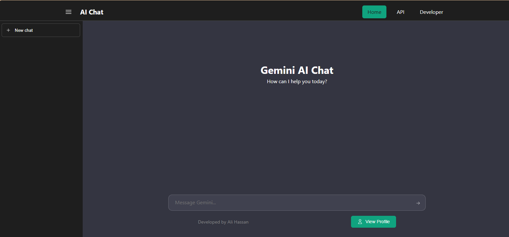
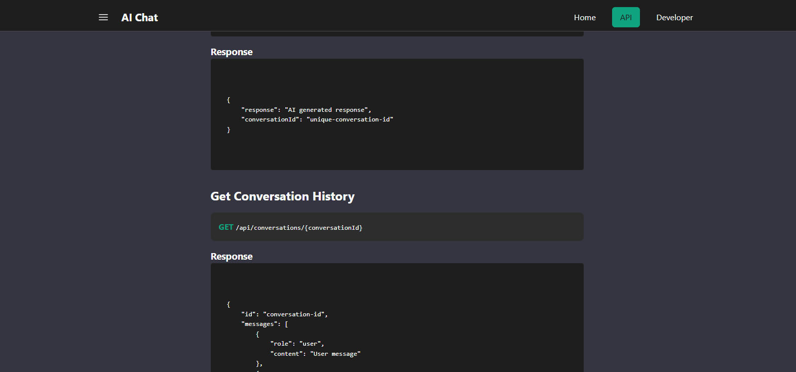
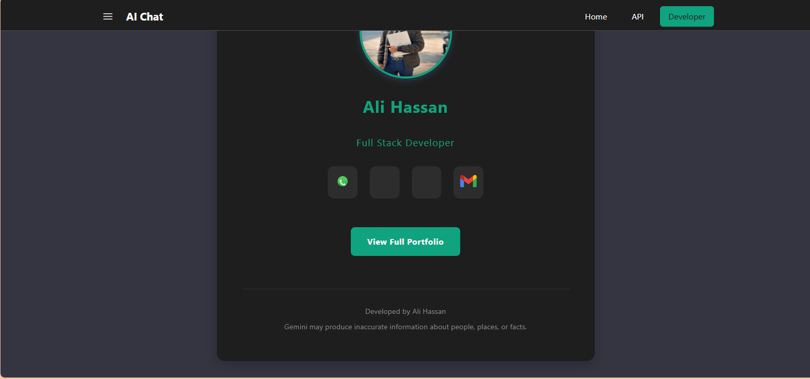
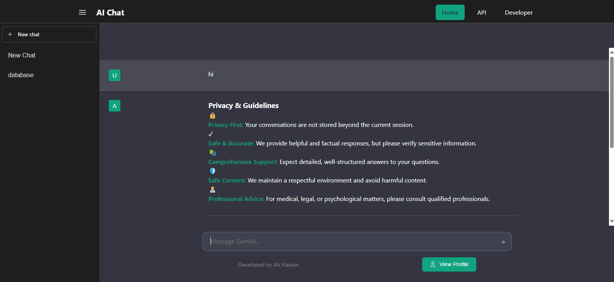
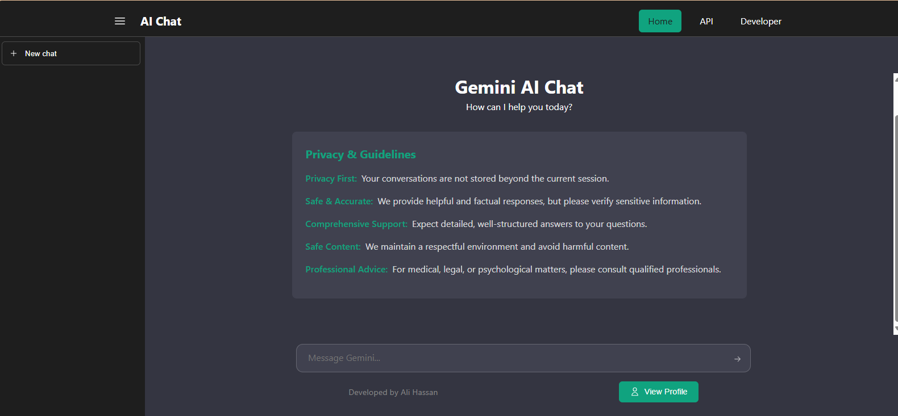
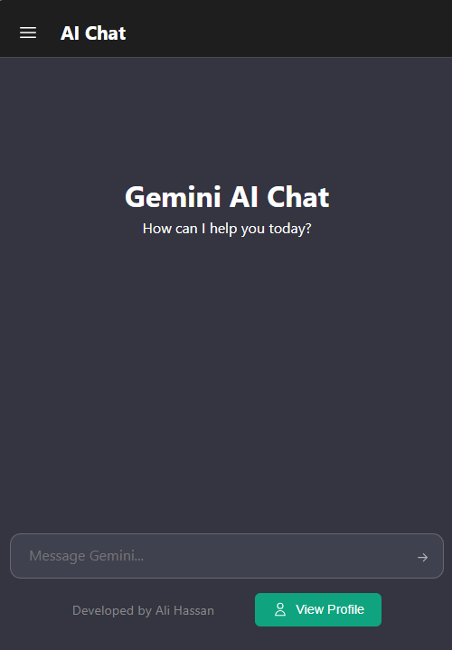
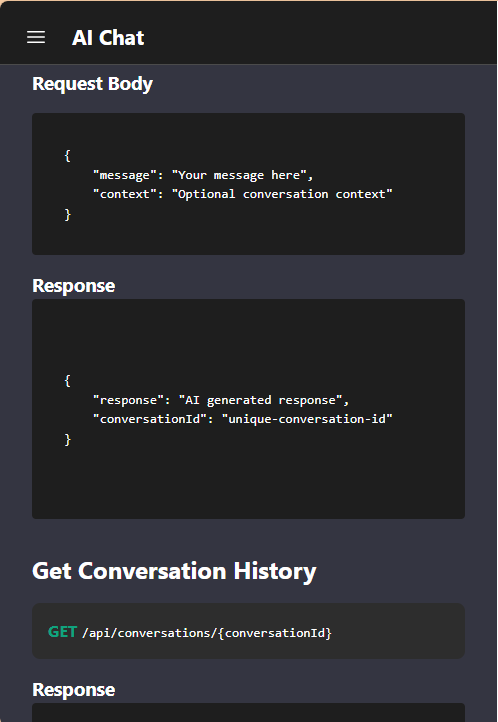
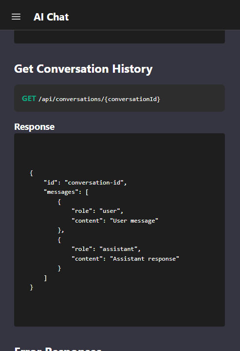

      <h1>  Gemini AI Chat</h1>
      <h3>An Advanced AI Chat Interface Powered by Google's Gemini Pro</h3>

    
    
    

# 📌 Overview

Gemini AI Chat is a modern chat interface that leverages the power of Google's Gemini Pro AI model. It provides an intuitive platform for users to interact with advanced AI, featuring code highlighting, responsive design, and a clean user interface.

# 🛠️ Tech Stack

## 📸 Screenshots

  <!-- Welcome & Chat Interface -->
  <h4>Welcome & Chat Interface</h4>
  
  
    

  <!-- Code Response Examples -->
  <h4>Code Highlighting & Responses</h4>
  
  
  
  
    

  <!-- API Documentation -->
  <h4>API Documentation Interface</h4>
  
  
  
  
    

  <!-- Developer Profile -->
  <h4>Developer Profile</h4>
  
  
  
    

  <!-- Privacy Guidelines -->
  <h4>Privacy & Guidelines</h4>
  
  
  
    

  <!-- Mobile Interface -->
  <h4>Mobile Interface</h4>
  

    
    
    
    
  

  <!-- Mobile API Guide -->
  <h4>Mobile API Documentation</h4>
  

    
    
    
    
    
  

## 🔑 Key Features

### Chat Interface

- Real-time AI responses using Gemini Pro
- Code syntax highlighting with Prism.js
- Copy code functionality
- Message history
- Loading states and animations

### Navigation & Layout

- Responsive navigation bar
- Mobile-friendly sidebar
- Clean and intuitive interface
- Smooth transitions

### Technical Features

- TypeScript for type safety
- Firebase hosting and deployment
- Local storage for chat persistence
- Error handling and user feedback
- Mobile-first responsive design

### Documentation

- Comprehensive API documentation
- Developer profile section
- Privacy guidelines and usage instructions
- Clear navigation structure

## 📄 License

This project is licensed under the MIT License - see the [LICENSE](LICENSE) file for details.

## 👨‍💻 Developer

Developed with ❤️ by [Ali Hassan](https://jamalihassan0307.github.io/portfolio.github.io/#!/)
